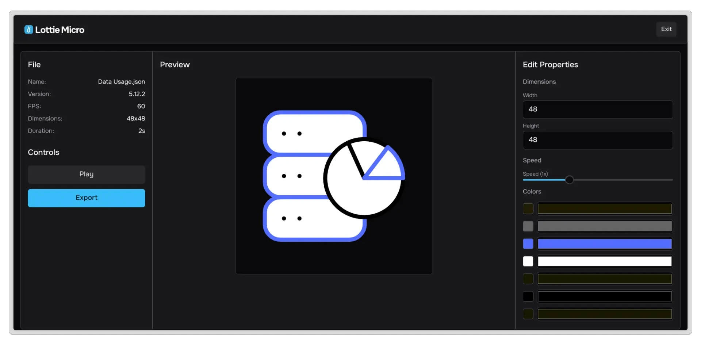

# Lottie Micro

A Minimal Lottie Editor



## Getting Started

This project uses **Bun** as the JavaScript runtime and package manager.

To get started with Lottie Micro, follow these steps:

```bash
git clone git@github.com:francids/lottie-micro.git
cd lottie-micro
bun i
bun dev
```
